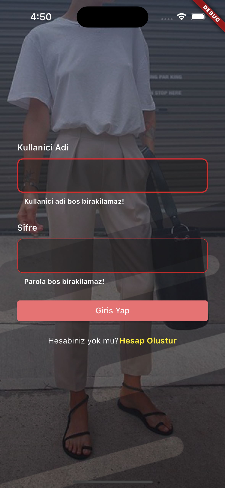
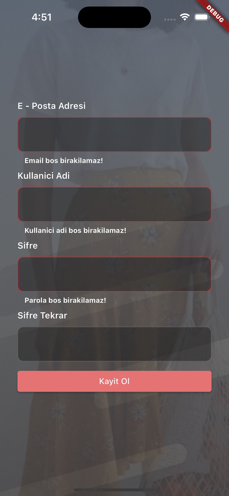
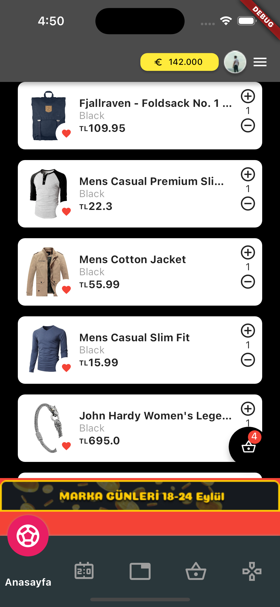
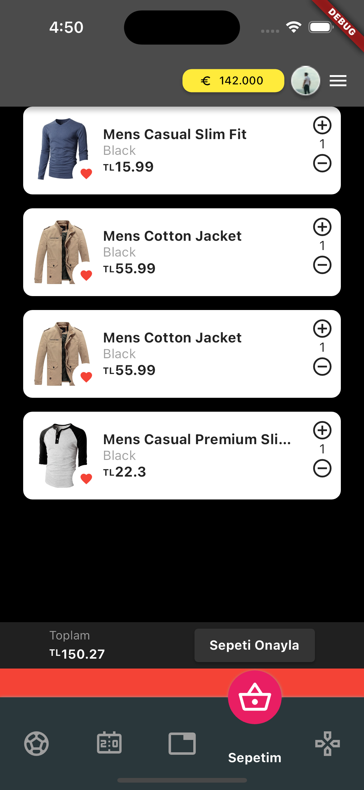
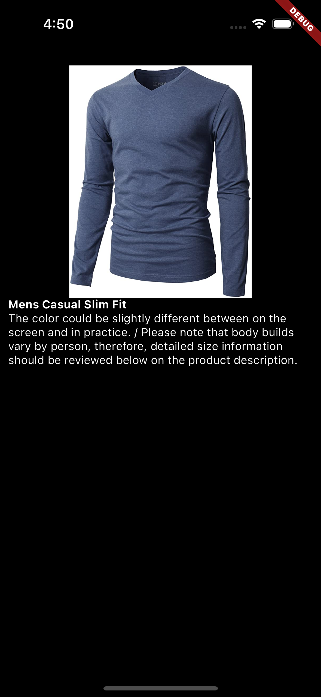

# shopapp

Clean Arhitechture mimarisi kullanılarak geliştirilmiştir.

## Kullanılan Paketler

- [http](https://pub.dev/packages/http)
- [get_it](https://pub.dev/packages/get_it)
- [flutter_bloc](https://pub.dev/packages/flutter_bloc)
- [equatable](https://pub.dev/packages/equatable)
- [circular_bottom_navigation](https://pub.dev/packages/circular_bottom_navigation)

## Ürünlerin getirildiği servis
- [Fake Store API](https://fakestoreapi.com/)

## Geliştirme Ortamı
-MacOs Sonoma
-Iphone 15 Pro (IOS 17.0)

## Refactoring Adımları

- Login ve register işlemleri sırasında kontrol yapan bloc yapısı düzeltilmeli.
Hatalar ekranın içinde gösterilecek. (Kritik bug!)

- Detay ekranı ayrı navigate işlemi yapılmayacak.

- Textfieldların boyutları tasarıma uygun düzeltielecek.

- Bottom navbar içindeki ikonlar gerçek ikonlar ile değiştirilecek (sepet vs)

## Proje Yapisi

-lib
    -core
        -constants
        -resources
        -routes
    -features
        -auth
            -data
                -datasources
                -models
                -repositories
            -domain
                -repositories
                -entities
                -usecases
            -presentation
                -bloc
                -mixin
                -pages
                -widgets
        -home
            -data
                -datasources
                -models
                -repositories
            -domain
                -repositories
                -entities
                -usecases
            -presentation
                -bloc
                    -basket
                    -home
                    -remote
                -pages
                -widgets
    -injection_container.dart
    -main.dart

## Ekran Görüntüleri

-Login Sayfası

-Register Sayfası

-Home Sayfası

-Sepet Sayfası

-Ürün Detay Sayfası

